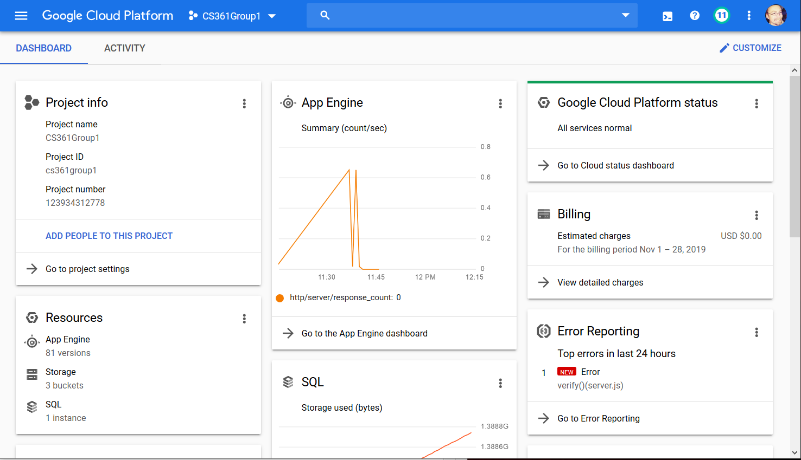
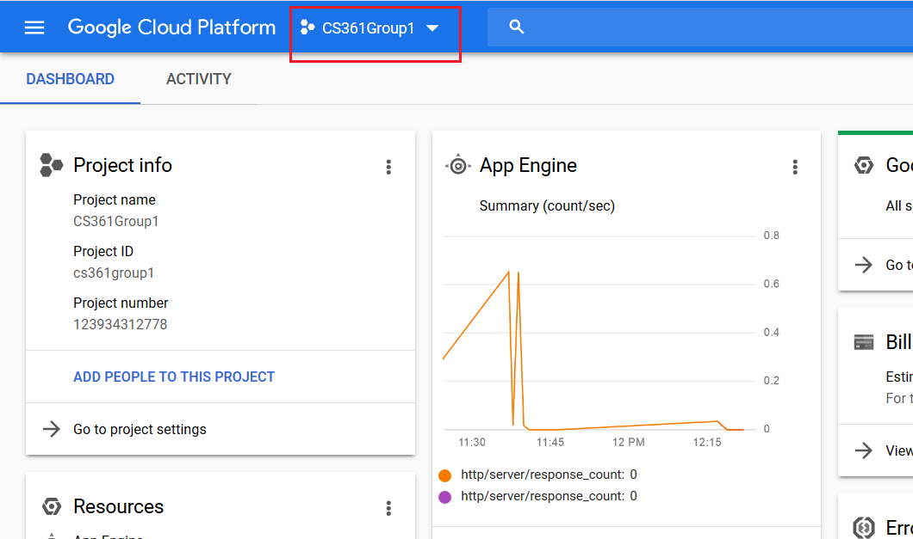
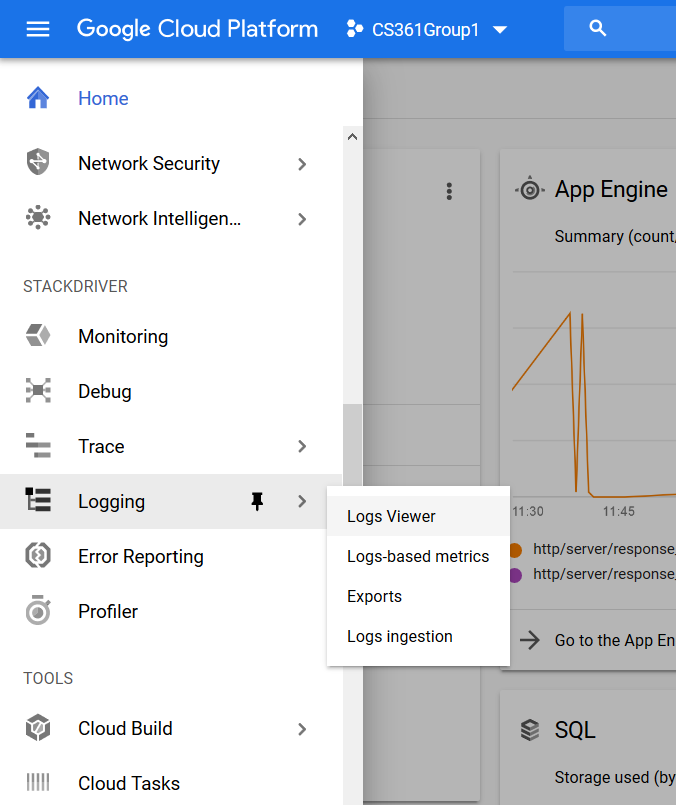
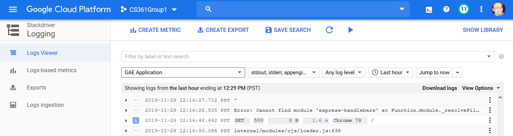
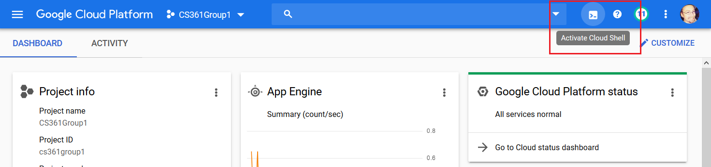
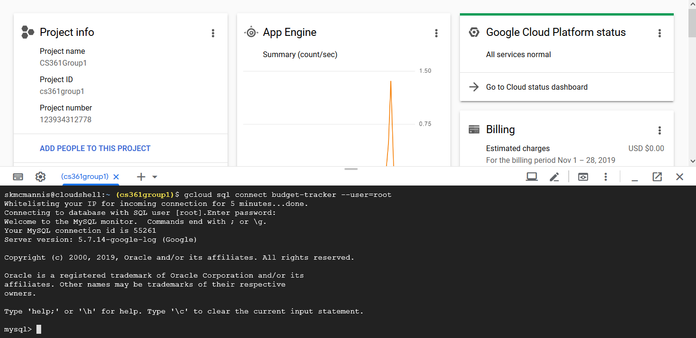

# cs361
For CS361 Group 1 HW 6 &amp; 7

# Environment setup for Google Cloud with Node JS (Express)
Project Name: CS361Group1
Server URL: https://cs361group1.appspot.com

Download and install the Google Cloud sdk from: https://cloud.google.com/sdk/docs/
When the installer runs ‘gcloud init’ you’ll be prompted to set up a configuration. Since I’ve added all of your OSU accounts to our project, you should see ‘CS361Group1’ as an option to select.

Download and install NVM (Node Version Manager)
For Windows machines, you’ll need to get it from here: https://github.com/coreybutler/nvm-windows
Mac/Linux can get it from here: https://github.com/nvm-sh/nvm

Install Node JS and NPM (Node Package Manager) from the command line via NVM. Instructions here: https://cloud.google.com/nodejs/docs/setup
The specific command to run for this is ‘nvm install latest’
After step three, try running the ‘npm’ command. If it says it npm isn’t installed, try the following (I ran into issues here, you may not) (note, the following worked on my Windows 10 machine)

Add the location of of your nodejs installation to your Environmental (user and system) Path variables. In my case this location was: C:\Users\skmcm\AppData\Roaming\nvm\v13.2.0
If you run the ‘npm’ command after this and get a response that ‘node’ cannot be found, go to the directory you added to the Path variables and locate the ‘node64.exe’ or ‘node32.exe’ files. Rename this file to ‘node.exe’. Try running ‘npm’ again. At this point it should work and return a list of possible npm commands

Create a new subdirectory to store the server files
Copy the server files to this directory. These files are as follows:
server.js
package.json
app.yaml

The server.js file is where we’ll be doing our coding. The app.yaml file doesn’t ever need to be edited, and the package.json file will automatically update when running ‘npm install’ commands. (This is how packages and dependencies are installed.)

After step 6 (copying newest versions of server files to your local directory), run the ‘npm install’ command to make sure you have all the current dependencies installed locally.

At this point take a look at the documentation at the following link, as well as the next page (“Deploying your web service”): https://cloud.google.com/appengine/docs/standard/nodejs/building-app/writing-web-service
This is the basic web service contained in the server.js file
Go to https://cs361group1.appspot.com to see it in action
When you make edits to the server.js file and want to upload it for testing, run the ‘gcloud app deploy’ command. Once that’s done the changes are uploaded and in place, allowing testing.

# Google Cloud Console
Since you should all have access to the project on Google Cloud, there are some resources you can take
advantage of online, specifically the Google Cloud Console. Go to https://console.cloud.google.com/ and log in with your OSU Google account.
After logging in, you should see something like this:

Make sure you have the proper project selected at the top of the page:

From this dashboard you can see all kinds of stats for the project, so feel free to explore (just don't change any settings you're not sure about.)

Two areas that might be useful for you are log viewing and database interactivity.

Log Viewing:
Open the navigation menu on the left and go down to 'Stackdriver' -> 'Logging':

From here you'll be taken to the log viewer:

Here you'll see all the logs from the server. This can be helpful for debugging, as you'll see errors registered here, as well as any 'console.log()' statements in the server code.

Database Commands:
To run commands directly against our MySQL database, you'll need to access the interactive shell via Google Cloud Console. This can be done from anywhere in the Console:

Once this loads, you'll want to enter the following command to log in to our instance: 
'gcloud sql connect budget-tracker --user=root'

When prompted for a password, enter [REDACTED]. After this you'll be presented with the 'mysql>' prompt, where you can issue commands to our database.

The actual database is named 'cs361', so your first command should be 'use cs361' so you get connected to the right database. After that it's just a matter of making the usual SQL commands to the database.